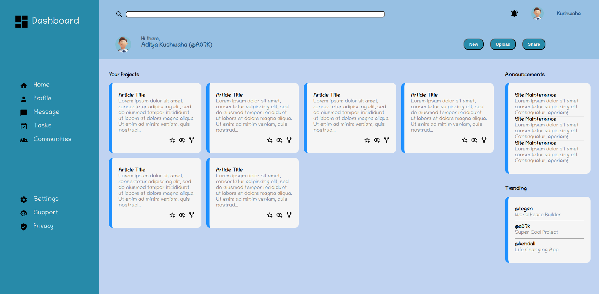

# <a href="https://your-username.github.io/admin-dashboard/">Admin Dashboard</a>

<h2>Description</h2>

This project is an Admin Dashboard layout created using HTML and CSS. It demonstrates the use of CSS Grid and Flexbox for creating a responsive and visually appealing dashboard interface.

<h2>Features</h2>

<ul>
  <li>Responsive layout using CSS Grid and Flexbox</li>
  <li>Sidebar navigation with icon links</li>
  <li>Header with search functionality and user profile</li>
  <li>Main content area with project cards</li>
  <li>Announcements and Trending sections</li>
  <li>Custom styling for buttons and cards</li>
</ul>

<h2>Technologies Used</h2>

<ul>
  <li>HTML5</li>
  <li>CSS3 (with Grid and Flexbox)</li>
</ul>

<h2>Setup and Installation</h2>

<ol>
  <li>Clone the repository:
    <pre><code>git clone https://github.com/your-username/admin-dashboard.git</code></pre>
  </li>
  <li>Navigate to the project directory:
    <pre><code>cd admin-dashboard</code></pre>
  </li>
  <li>Open the index.html file in your web browser to view the dashboard.</li>
</ol>

<h2>Usage</h2>

The dashboard is divided into several sections:

<ul>
  <li>Sidebar: Contains navigation links with icons</li>
  <li>Header: Includes a search bar, notifications, and user profile</li>
  <li>Main Content: Displays project cards and additional information</li>
  <li>Announcements: Shows important updates</li>
  <li>Trending: Highlights trending items or users</li>
</ul>

This layout can be customized and expanded to fit various admin panel needs.

